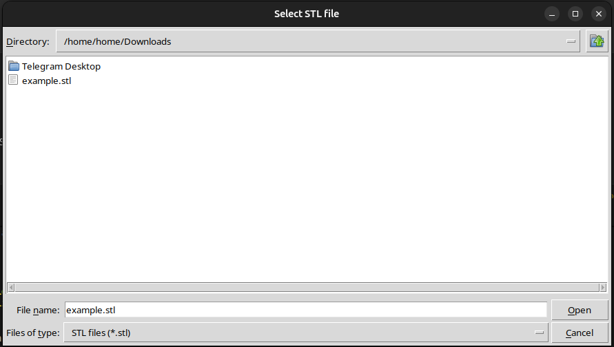
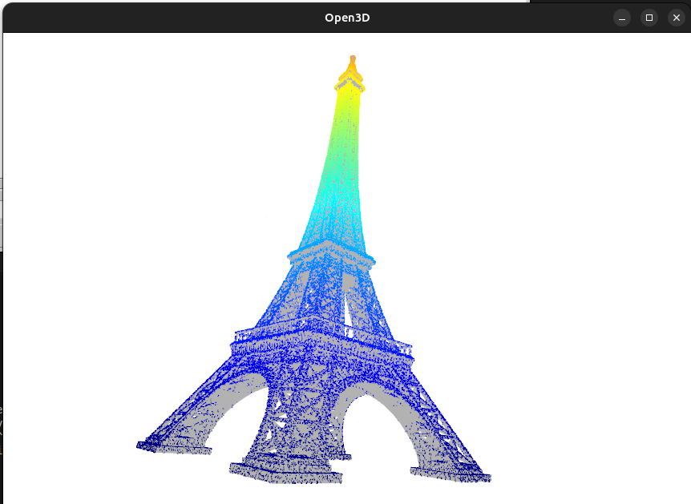
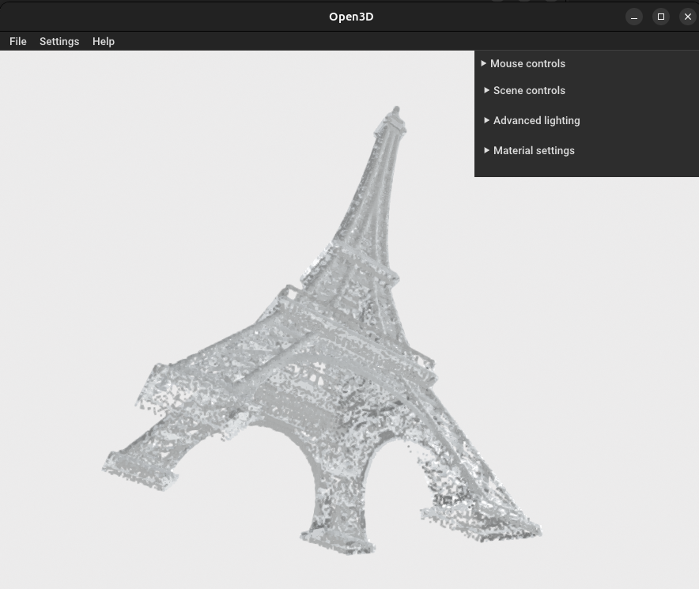

# Synthetic Point Cloud Generator

Minimal pipeline for generating synthetic point clouds from CAD models via raycasting.

Simulates how an industrial scanner (e.g. Gocator) would capture a part — producing a point cloud that reflects a real scanning angle, not just sampled surface points. Sampling directly from a mesh does not produce a realistic result; raycasting from a camera position does.

Built as a public minimal version of a production tool I use for testing point cloud matching algorithms in industrial welding robotics.

## Usage

```bash
python -m venv .venv
source .venv/bin/activate
pip install -r requirements.txt
python generate.py
```

A file picker will open — select your STL file. The script will:
1. Place cameras in a circular pass around the part
2. Simulate the scan via raycasting
3. Display the resulting point cloud overlaid on the mesh
4. Save the point cloud as a `.ply` file in the same directory as the input STL

## Screenshots

| Select STL | Raycasting on mesh | Final point cloud |
|:-----------:|:------------------:|:-----------------:|
|  |  |  |
